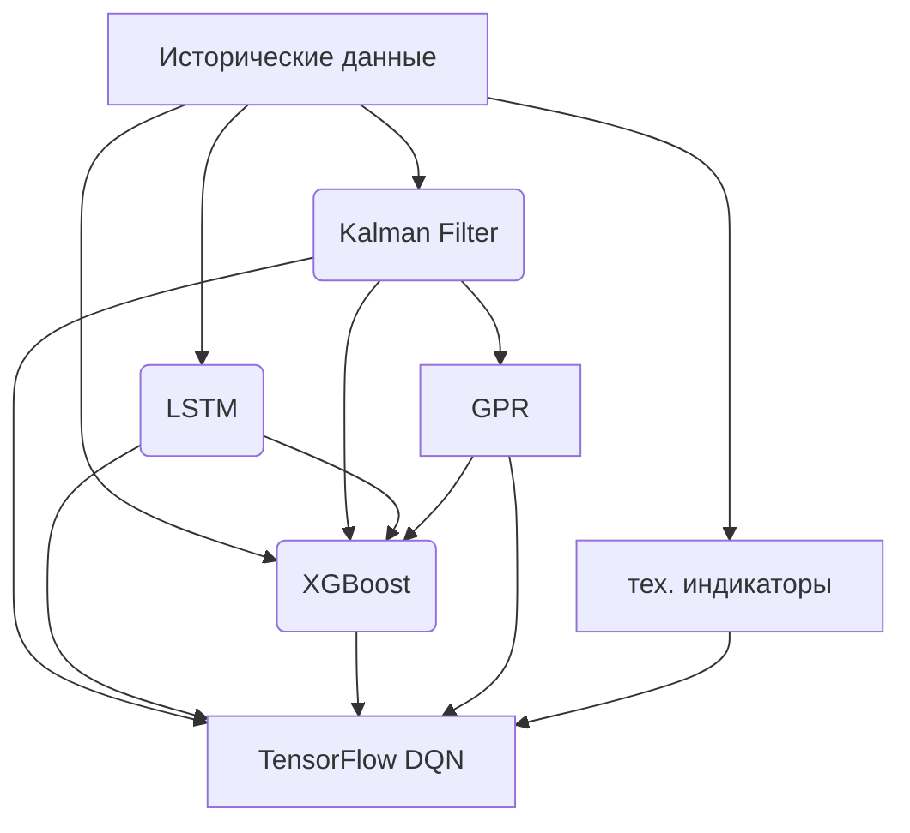

# Архитектура Расширенной Торговой Системы с Интеграцией Kalman Filter, LSTM, GPR

## Общая архитектура системы

## Подробное описание компонентов

### 1. Скриннер (screener.py)
- Сканирует монеты на наличие всплеска объема
- При обнаружении подходящей монеты записывает данные в `live_data.json`
- Устанавливает статус трейдера в 'BUSY'

### 2. Загрузка данных (run_live_trading.py)
- Читает данные из `live_data.json` при получении статуса 'BUSY'
- Подготавливает данные для расчета индикаторов

### 3. Расчет индикаторов (feature_engineering.py)
- Вычисляет технические индикаторы:
  - Bollinger Bands (BBL_20_2.0, BBM_20_2.0, BBU_20_2.0, BBB_20_2.0, BBP_20_2.0)
  - MACD (MACD_12_26_9, MACDh_12_26_9, MACDs_12_26_9)
  - OBV (OBV)
  - ATR (ATRr_14)
  - Williams %R (WILLR_14)
  - RSI (RSI_14)
  - CCI (CCI_20_0.015)
  - ADX (ADX_14, DMP_14, DMN_14)

### 4. Kalman Filter (kalman_filter.py)
- Сглаживает и фильтрует данные, устраняя шумы
- Выделяет тренды и оценивает текущее состояние рынка
- Передает сглаженные сигналы и оценки состояния в GPR

### 5. Gaussian Process Regression (GPR) (gpr_model.py)
- Получает данные от Kalman Filter
- Оценивает прогнозы с учетом неопределенности
- Передает прогнозы и меры неопределенности в TensorFlow DQN

### 6. LSTM (lstm_model.py)
- Получает временную последовательность данных (окно из 60-120 последних свечей)
- Выявляет глубокие временные закономерности и паттерны
- Передает обнаруженные паттерны в TensorFlow DQN

### 7. XGBoost (xgboost_model.py)
- Получает признаки от Kalman Filter и технические индикаторы на этапе обучения
- На этапе торговли также получает сигналы от LSTM и GPR
- Обогащает вектор признаков, захватывая нетривиальные зависимости
- Передает чистые сигналы в TensorFlow DQN

### 8. TensorFlow DQN (dqn_trading_model.zip)
- Получает на вход итоговый супервектор:
  - Технические индикаторы
  - Сигналы/оценки от Kalman Filter
  - Прогнозы и неопределенности GPR
  - Паттерны от LSTM
  - Фичи-типы/решения XGBoost
- Агрегирует всю информацию и принимает торговое действие (buy/sell/hold)
- Обучается на результатах сделок (reward)
- Получает данные от всех моделей напрямую через единый вектор признаков

### 9. Принятие решения (run_live_trading.py)
- Интерпретирует решение DQN
- Определяет тип действия: BUY, SELL или HOLD

### 10. Открытие/закрытие позиций (trade_manager.py)
- Открывает рыночные позиции через API Bybit
- Закрывает позиции по достижению TP/SL или по решению модели

### 11. Логирование сделок (trade_logger.py)
- Записывает все сделки в `trade_log.csv`
- Сохраняет индикаторы и решения всех моделей
- Используется для обучения моделей

### 12. Обучение моделей (train_model.py, train_xgboost_historical.py, retrain_lstm_model.py, retrain_kalman_filter.py, retrain_gpr_model.py)
- Обучает модели на основе логов сделок и исторических данных
- Периодически переобучает все модели для адаптации к изменяющимся рыночным условиям

## Поток данных в системе

1. Входные данные: исторические цены (OHLCV)
2. Kalman Filter: сглаживает данные и выделяет тренд
3. Gaussian Process Regression: получает данные от Kalman Filter и оценивает прогнозы с учетом неопределенности
4. LSTM: получает временную последовательность данных и выявляет временные паттерны
5. XGBoost: получает признаки от Kalman Filter и технические индикаторы на этапе обучения, на этапе торговли также получает сигналы от LSTM и GPR
6. Технические индикаторы: вычисляются отдельно
7. TensorFlow DQN: получает данные от всех моделей через единый вектор признаков и принимает финальное торговое решение
8. Логирование: запись всех действий для последующего обучения, включая данные от всех моделей

## Периодическое переобучение моделей

| Модель | Частота переобучения | Источник данных | Особенности |
|--------|----------------------|-----------------|-------------|
| TensorFlow DQN | Непрерывно | Логи сделок | Самообучается на каждой сделке |
| LSTM | Еженедельно | Исторические свечи | Требует полного переобучения |
| XGBoost | Еженедельно | Исторические данные и индикаторы | Требует полного переобучения |
| Kalman Filter | Онлайн | Поток рыночных данных | Адаптируется автоматически |
| Gaussian Process Regression | Ежедневно | Исторические данные | Вычислительно дорогая, требует оптимизации. Для каждого символа используется максимум 1000 последних примеров. |

## Преимущества новой архитектуры

1. **Многоуровневая обработка данных**: каждая модель специализируется на своей задаче
2. **Снижение влияния шума**: Kalman Filter и GPR улучшают качество входных данных
3. **Учет неопределенности**: GPR предоставляет оценки надежности сигналов
4. **Глубокое понимание паттернов**: LSTM выявляет слож