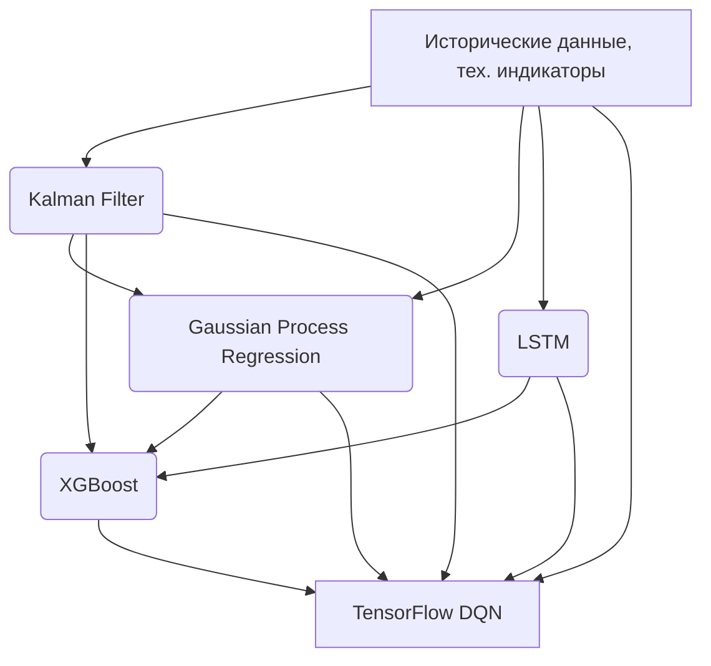

# Документация по Интеграции Kalman Filter, LSTM и GPR с TensorFlow DQN и XGBoost

## Общая архитектура интеграции

В новой архитектуре торговой системы все пять моделей (Kalman Filter, LSTM, GPR, XGBoost, TensorFlow DQN) работают совместно для принятия торговых решений. Каждая модель имеет свою специализацию и передает свои результаты следующим моделям в цепочке.

## 1. Kalman Filter

### Назначение
Kalman Filter используется для сглаживания рыночных данных и устранения шума. Он помогает выделить основной тренд и оценить текущее состояние рынка.

### Интеграция
- Получает на вход сырые рыночные данные (цены, объемы)
- Сглаживает данные и выделяет тренд
- Передает сглаженные данные и оценки состояния в GPR и XGBoost
- Работает в онлайн-режиме, адаптируясь к изменяющимся условиям

### Математическая модель
Фильтр Калмана описывается следующими уравнениями:

Предсказание состояния:
```
x_k_pred = F_k * x_{k-1} + B_k * u_k
P_k_pred = F_k * P_{k-1} * F_k^T + Q_k
```

Обновление состояния:
```
y_k = z_k - H_k * x_k_pred
S_k = H_k * P_k_pred * H_k^T + R_k
K_k = P_k_pred * H_k^T * S_k^{-1}
x_k = x_k_pred + K_k * y_k
P_k = (I - K_k * H_k) * P_k_pred
```

Где:
- x_k - вектор состояния
- P_k - ковариационная матрица ошибки
- F_k - матрица перехода состояний
- B_k - матрица управления
- u_k - вектор управления
- Q_k - ковариационная матрица шума процесса
- z_k - вектор измерений
- H_k - матрица преобразования состояния в измерения
- R_k - ковариационная матрица шума измерений
- K_k - коэффициент усиления Калмана

## 2. Gaussian Process Regression (GPR)

### Назначение
GPR используется для прогнозирования рыночных данных с учетом неопределенности. Он оценивает надежность прогнозов и передает эту информацию следующим моделям.

### Интеграция
- Получает данные от Kalman Filter
- Оценивает прогнозы и меры неопределенности
- Передает прогнозы и меры неопределенности в XGBoost

### Математическая модель
GPR основана на гауссовских процессах, которые определяются средней функцией m(x) и ковариационной функцией k(x, x'):

```
f(x) ~ GP(m(x), k(x, x'))
```

Прогноз для нового значения:
```
p(f_*|X, f, X_*) = N(f_*|μ_*, σ_*^2)
```

Где:
- μ_* = k(X_*, X) * (K(X, X) + σ_n^2 * I)^{-1} * f
- σ_*^2 = k(X_*, X_*) - k(X_*, X) * (K(X, X) + σ_n^2 * I)^{-1} * k(X, X_*)
- k(X_*, X) - ковариационная функция между новыми и обучающими точками
- K(X, X) - ковариационная матрица обучающих точек
- σ_n^2 - дисперсия шума

## 3. LSTM (Long Short-Term Memory)

### Назначение
LSTM используется для выявления сложных временных паттернов в рыночных данных. Она способна запоминать долгосрочные зависимости в данных.

### Интеграция
- Получает временную последовательность данных (окно из 60-120 последних свечей)
- Выявляет временные паттерны и зависимости
- Передает обнаруженные паттерны в XGBoost

### Математическая модель
LSTM использует три вентиля (gate) для управления потоком информации:

Вентиль забывания:
```
f_t = σ(W_f * [h_{t-1}, x_t] + b_f)
```

Вентиль входа:
```
i_t = σ(W_i * [h_{t-1}, x_t] + b_i)
```

Кандидат значения ячейки:
```
C̃_t = tanh(W_C * [h_{t-1}, x_t] + b_C)
```

Обновление состояния ячейки:
```
C_t = f_t * C_{t-1} + i_t * C̃_t
```

Вентиль выхода:
```
o_t = σ(W_o * [h_{t-1}, x_t] + b_o)
```

Скрытое состояние:
```
h_t = o_t * tanh(C_t)
```

Где:
- f_t, i_t, o_t - значения вентилей забывания, входа и выхода
- C_t - состояние ячейки
- h_t - скрытое состояние
- σ - сигмоидальная функция активации
- tanh - гиперболический тангенс

## 4. XGBoost

### Назначение
XGBoost используется для обогащения вектора признаков и захвата нетривиальных зависимостей между всеми источниками сигналов.

### Интеграция
- Получает признаки от всех предыдущих моделей (Kalman Filter, GPR, LSTM) и технические индикаторы
- Обогащает вектор признаков, захватывая нетривиальные зависимости
- Передает чистые сигналы в TensorFlow DQN

### Математическая модель
XGBoost минимизирует следующую целевую функцию:

```
L(φ) = ∑_{i=1}^n l(y_i, ŷ_i^{(t-1)} + f_t(x_i)) + Ω(f_t)
```

Где:
- l - функция потерь
- ŷ_i^{(t-1)} - прогноз после t-1 шагов
- f_t - функция, добавляемая на шаге t
- Ω(f_t) - регуляризационный член

Регуляризационный член:
```
Ω(f) = γT + 1/2 λ∑_{j=1}^T w_j^2
```

Где:
- T - количество листьев
- w_j - вес j-го листа
- γ, λ - параметры регуляризации

## 5. TensorFlow DQN

### Назначение
TensorFlow DQN является основным "мозгом" системы, который принимает финальные торговые решения на основе всех входных данных.

### Интеграция
- Получает на вход итоговый супервектор, включающий:
  - Технические индикаторы
  - Сигналы/оценки от Kalman Filter
  - Прогнозы и неопределенности GPR
  - Паттерны от LSTM
  - Фичи-типы/решения XGBoost
- Агрегирует всю информацию и принимает торговое действие (buy/sell/hold)
- Обучается на результатах сделок (reward)

### Математическая модель
DQN использует Q-обучение для оценки ценности действий:

```
Q(s, a) = E[R_t + γ max_{a'} Q(s', a') | s_t = s, a_t = a]
```

Где:
- Q(s, a) - ценность действия a в состоянии s
- R_t - вознаграждение в момент времени t
- γ - коэффициент дисконтирования
- s' - следующее состояние

Нейронная сеть DQN аппроксимирует Q-функцию:
```
Q(s, a; θ) ≈ Q(s, a)
```

Где θ - параметры нейронной сети.

## Поток данных в системе

1. Входные данные: исторические цены (OHLCV), технические индикаторы
2. Kalman Filter: сглаживает данные и выделяет тренд
3. GPR: оценивает прогнозы с учетом неопределенности
4. LSTM: выявляет временные паттерны в данных
5. XGBoost: обогащает вектор признаков и передает сигналы в DQN
6. TensorFlow DQN: принимает финальное торговое решение
7. Логирование: запись всех действий для последующего обучения

## Взаимодействие между моделями



## Преимущества такой интеграции

1. **Снижение влияния шума**: Kalman Filter и GPR улучшают качество входных данных
2. **Учет неопределенности**: GPR предоставляет оценки надежности сигналов
3. **Глубокое понимание паттернов**: LSTM выявляет сложные временные зависимости
4. **Комплексное принятие решений**: DQN учитывает все источники информации
5. **Адаптация к рынку**: регулярное переобучение моделей обеспечивает актуальность стратегии