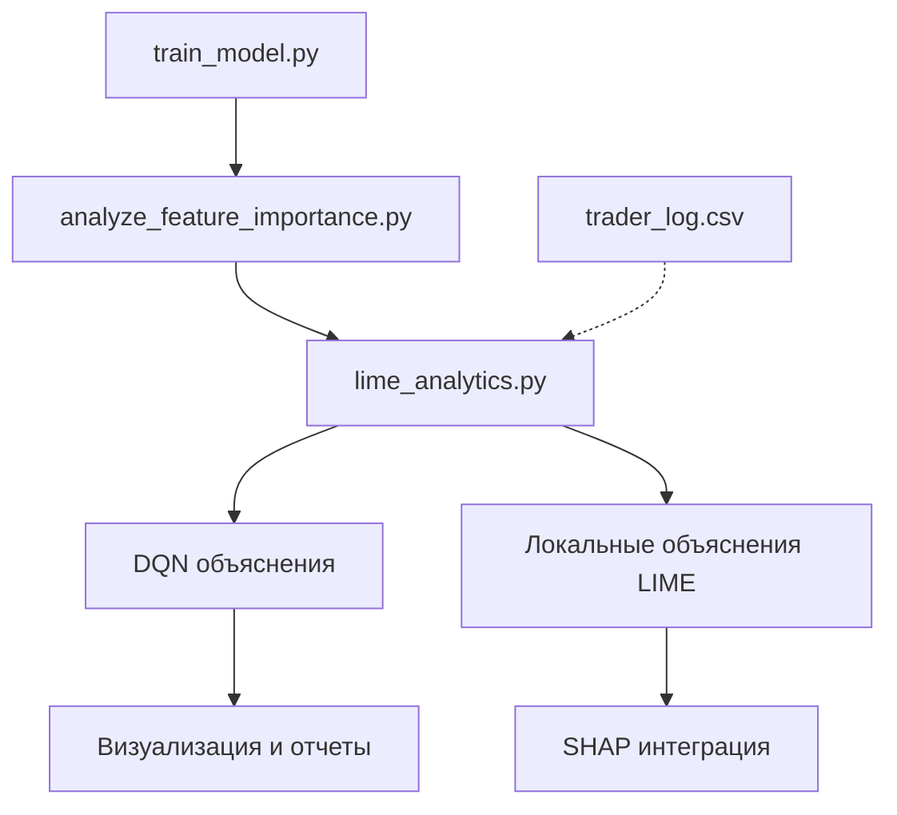

# Архитектура LIME для объяснимости решений DQN в торговом боте

## Обзор

Этот документ описывает архитектуру и план внедрения объяснимости решений DQN (Deep Q-Network) с использованием LIME (Local Interpretable Model-Agnostic Explanations) в торговом боте на базе нейронных сетей. Цель - предоставить пост-тренинговые локальные объяснения решений DQN на основе данных trader_log.csv, без изменения существующих структур данных.

## Задачи проекта

### Основные задачи
- [ ] Реализовать локальную объяснимость решений DQN с помощью LIME
- [ ] Интегрировать объяснения в workflow после обучения модели (после train_model.py и analyze_feature_importance.py)
- [ ] Создать визуализации и отчеты для каждого решения DQN
- [ ] Обратить особое внимание к особенностям финансовых данных и рисков LIME

### Технические требования
- [ ] Совместимость с существующими структурами торгового бота
- [ ] Обработка 34 столбцов trader_log.csv без модификации
- [ ] Гибкость настройки параметров LIME
- [ ] Генерация отчетов в читаемом формате

## Описание решения

### Архитектурная схема

### Компоненты системы

#### 1. Данные входа
- **trader_log.csv**: Основной источник данных (34 столбца)
- **DQN модель**: Обученная модель из train_model.py
- **SHAP анализа**: Глобальные важности признаков из analyze_feature_importance.py

#### 2. LIME движок
- **Интерпретируемые признаки**: Преобразование в дискретные bins
- **Генерация возмущений**: Создание синтетических выборок
- **Локальные модели**: Обучение простых моделей вокруг выбранных решений
- **Объяснения**: Весовые коэффициенты для каждого признака

#### 3. Вывод и интеграция
- **Отчеты по решениям**: За каждым действием DQN
- **Визуализации**: Графики важности признаков
- **Интеграция с SHAP**: Сочетание локальных и глобальных объяснений

## Риски и ограничения LIME

### Технические риски
- **Нестабильность объяснений**: LIME может давать разные объяснения для похожих входов
- **Зависимость от параметров**: Количество выборок, размер окрестности влияют на результаты
- **Сложность данных**: Финансовые данные могут иметь неинтерпретируемые взаимодействия
- **Вычислительная сложность**: Генерация множества возмущений для высокодименсиональных данных

### Риски для DQN объяснимости
- **Черный ящик RL**: DQN принимает состояния, но объяснения могут не отражать реальную логику
- **Не стационарность данных**: Финансовые временные ряды меняют распределения
- **Сдвиг данных**: Простые правила DQN могут не работать на тест данных из-за сдвигов

### Практические ограничения
- **Время вычислений**: Для большого числа решений потребуется оптимизация
- **Интерпретируемость модели**: Пользователь должен понимать объяснения LIME
- **Обновление данных**: При изменении структуры trader_log.csv требуется перенастройка

## Интеграция с существующей системой

### Workflow интеграции
1. **Пост-обучение**: После завершения train_model.py
2. **Анализ признаков**: После analyze_feature_importance.py (SHAP)
3. **LIME анализ**: Запуск lime_analytics.py на trader_log.csv
4. **Генерация отчетов**: Автоматическое создание объяснений для ключевых решений

### Связь с SHAP
- **Глобальные vs локальные**: SHAP для общего понимания, LIME для конкретных случаев
- **Комплементарность**: Использовать SHAP для выбора информативных признаков для LIME
- **Объяснения решений**: Комбинировать важности SHAP с весами LIME

## План реализации

### Этап 1: Основа системы
- [ ] Создать базовый класс для обработки trader_log.csv
- [ ] Реализовать интерфейс для загрузки DQN модели
- [ ] Настроить базовые параметры LIME (n_features, n_samples)

### Этап 2: LIME интеграция
- [ ] Реализовать функцию генерации возмущений
- [ ] Создать локальные модели (линейные регрессии)
- [ ] Настроить интерпретируемое пространство признаков

### Этап 3: Анализ и визуализация
- [ ] Создать шаблоны отчетов для решений DQN
- [ ] Реализовать графики важности признаков
- [ ] Настроить автоматизацию отчетов

### Этап 4: Тестирование и оптимизация
- [ ] Протестировать на исторических данных
- [ ] Оптимизировать производительность
- [ ] Проверить стабильность объяснений

## Отчетность и мониторинг

### Метрики успеха
- **Качество объяснений**: Корректность локальных объяснений
- **Стабильность**: Повторяемость результатов при повторных запусках
- **Производительность**: Время анализа набора решений
- **Полезность**: Восприятие объяснений пользователями

### Мониторинг
- Автоматические проверки на аномальные объяснения
- Журналирование процессов и результатов
- Веб-интерфейс для просмотра объяснений

## Будущие расширения

### Совместимость с другими методами
- [ ] Интеграция с SHAP KernelExplainer для лобальных объяснений
- [ ] Комбинация с Anchors и Counterfactuals
- [ ] Применение к другим RL архитектурам

### Продвинутые функции
- [ ] Автоматическое обнаружение значимых решений
- [ ] Пакетная обработка больших наборов данных
- [ ] Экспорт объяснений в стандартизированном формате

## Заключение

Данная архитектура обеспечивает последовательное внедрение LIME для объяснимости DQN, с учетом специфики финансовых данных и существующих ограничений системы. Узна изначальные задачи, архитектура фокусируется на локальной объяснимости конкретных решений, дополняя глобальный анализ SHAP. Предложенный подход позволит гарантировать прозрачность решений DQN, сохранить существующие структуры данных и снизить риски деплоя черного ящика. После утверждения плани начинается практическая реализация.